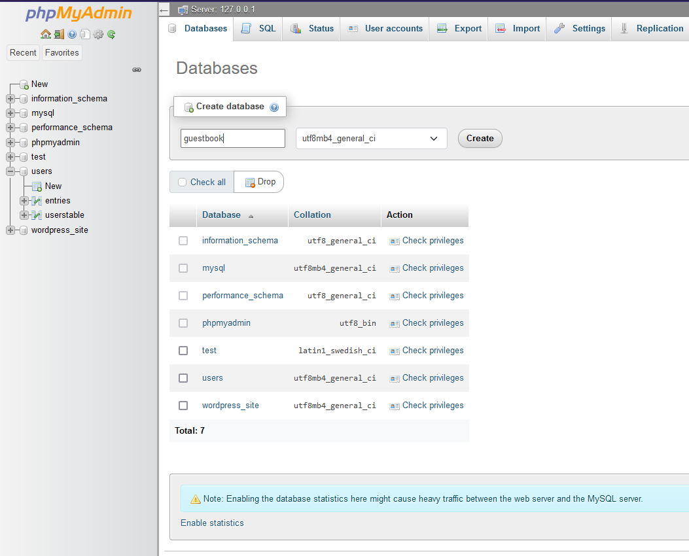

link project:::
https://hevodata.com/learn/xampp-mysql/#XAMPP_MySQL_Step_1_Opening_XAMPP
https://hevodata.com/learn/xampp-mysql/#XAMPP_MySQL_Step_1_Opening_XAMPP

we have database with name, then table in that database
sql tab, then insert with sql
insert into then cusetname content, then values for guestname
then columns, we have rows for each object, column for same values, all guestnames one column, then sql insert into entries

server localhost mysql

create table xampp mysql
, table table name number of columns

create database on local host

example database xampp mysql, we create  database, then we can fetch
first initiate database, then get connection

create xampp mysql database 
opening xampp
starting xampp
accessing adimin

sql phpmyadmin

step initiate datbase mysql 

create database then create table in that database sql query db

link::

https://hevodata.com/learn/xampp-mysql/

install mysql library 

https://www.youtube.com/watch?v=Hej48pi_lOc

https://www.youtube.com/watch?v=Hej48pi_lOc

you can insert in the sql tab, with intert into entries of our choosen guestbook datbase and the entires table::

INSERT INTO entries (guestName, content) values ("Humpty", "Humpty's here!");
INSERT INTO entries (guestName, content) values ("Dumpty", "Dumpty's here too!");

1.--create backend server.js -install express and have something on route, express on backend node.js
2.---call a route with our frontend, route has values due to backend with node and express

3:: installed express server with port, route, now data on exact location, link server
//http://localhost:5000/api/data --here data is connected, we now have server, install express server, named file server.js, then in our package.json we have start command and node server.js config entire project now running on port, server

4:: downloaded mysql worknbecnh, connection have d atabase for mysql --//password:: aaS!p9Wz@8bF#!

5:: probably

explanation:: stop, target is within the declaration before stop, clear target